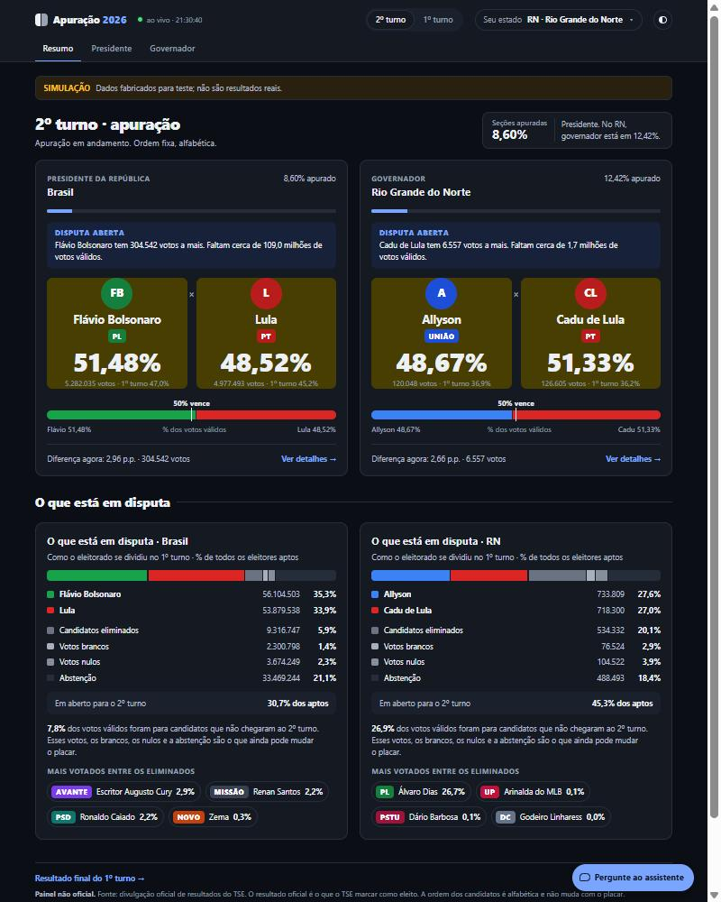
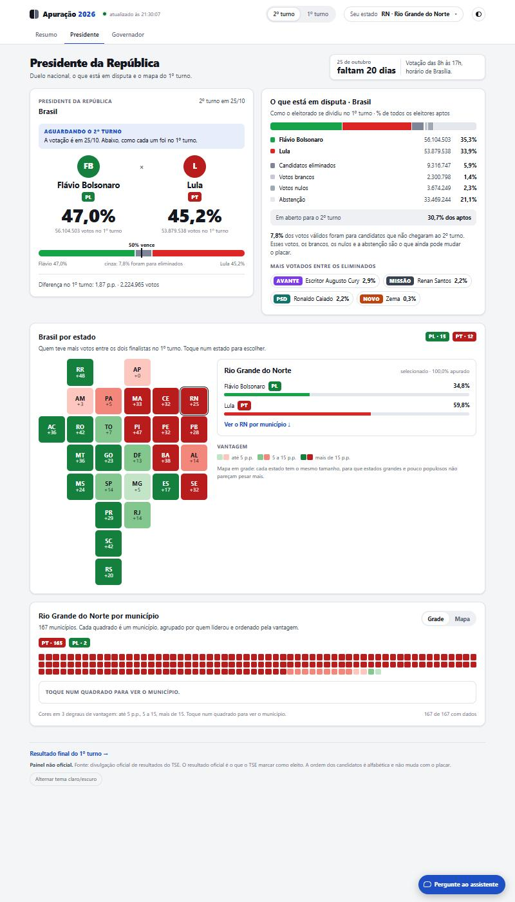
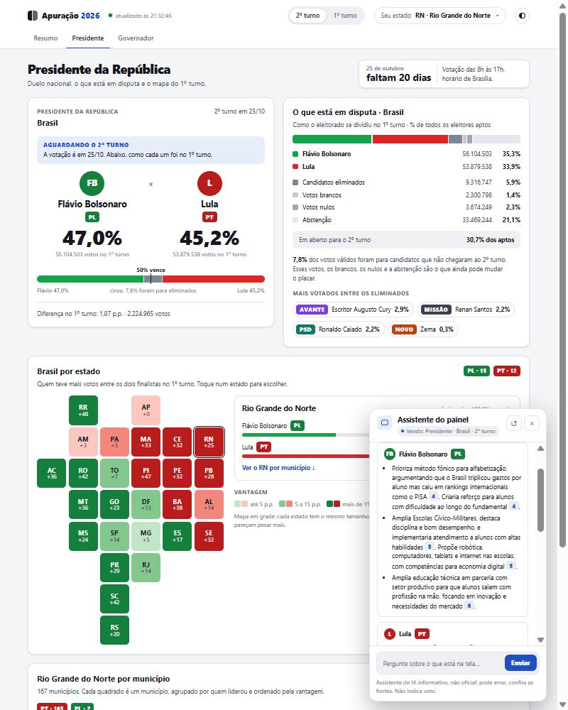

# Eleições 2026 — Live Election Dashboard + Grounded AI Assistant

**English** · [Português](#português)

A live results dashboard for Brazil's 2026 general election (data from the official TSE electoral court feed), with an
AI assistant that answers questions about **candidates' government plans** (RAG with page-level citations) and about
**the live numbers on screen** (computed in code, never guessed by the model).



> ⚠️ Unofficial. Not affiliated with the TSE. The official result is whatever the TSE marks as elected.

## Table of contents

- [Context](#context) · [Features](#features) · [Screenshots](#screenshots) · [Tech stack](#tech-stack)
- [Architecture](#architecture) · [AI design decisions](#ai-design-decisions) · [Getting started](#getting-started)
- [Using the platform](#using-the-platform) · [Testing and evaluation](#testing-and-evaluation) · [Project structure](#project-structure)
- [Limitations](#limitations) · [Roadmap](#roadmap) · [Notes](#notes)

## Context

Brazil votes in two rounds. The first round was on 4 Oct 2026; the **runoff is on 25 Oct 2026** for President
(Lula × Flávio Bolsonaro) and, in Rio Grande do Norte, Governor (Cadu de Lula × Allyson). The TSE publishes results as
static JSON files that refresh every few minutes, but there is no friendly view that connects them and no way to ask
"what does each candidate propose for education?" next to the numbers.

This project started as a terminal script and grew into a full-stack portfolio piece with three goals:

1. **Show live data clearly** — first and second round, by country and by state, with maps and parliamentary seat charts.
2. **Make the plans searchable** — official government plans filed with the TSE, split into citable passages.
3. **Do AI responsibly** — grounded answers, mandatory citations, strict neutrality between candidates, cost and abuse limits.

## Features

- **Runoff mode (2nd round)** with scoreboard, the 50% line, margin in votes, and "what is still up for grabs"
  (eliminated candidates' votes, blank, null, abstention). Before the TSE publishes runoff files (they return 404 until
  25 Oct) the dashboard detects this itself and shows each finalist's first-round performance. When files appear, it
  switches to live mode on its own.
- **First-round results** for President, Governor, Senate, federal and state deputies, with Congress seat projections.
- **Maps built from IBGE data**: a state cartogram for Brazil and a 167-municipality view for Rio Grande do Norte (grid
  or true-shape map, hover/focus/click detail panel).
- **Floating chat assistant on every page** that knows what is on screen ("who leads *here*?"), cites its sources and
  lets you open the original plan passage and page.
- **Built-in simulator** (`--simular-2t`) that fabricates runoff files from first-round data so the live screen can be
  tested end-to-end before election day (clearly labelled "SIMULAÇÃO").
- **Light/dark theme**, responsive layout (bottom-sheet chat on phones), accessible party colours (WCAG AA contrast),
  10-second polling that keeps your scroll position.

## Screenshots

| Runoff, live (simulated data) | Brazil cartogram + chat | |
|---|---|---|
|  |  |  |

The third image shows the assistant comparing education proposals: one block per candidate, **always in alphabetical
order** (enforced in the browser, not just requested from the model), with `[n]` citations that open the source passage.

## Tech stack

| Layer | Choice | Why |
|---|---|---|
| Backend | **Python 3.10+ standard library** (`http.server`, SSE streaming) | Zero-dependency server; easy to read, run, and audit |
| Frontend | **Single-file vanilla HTML/CSS/JS**, SVG charts and maps | No build step, no framework; the whole UI is inspectable |
| Data | TSE results JSON (`resultados.tse.jus.br`), IBGE meshes API (GeoJSON), TSE candidate-registration PDFs | Official public sources |
| Retrieval | **PyMuPDF** extraction → heading-aware chunking → **BM25** with Portuguese normalisation and stemming | Exact-term queries (names, programmes, numbers) work well; no vector DB needed at this corpus size |
| LLM | **Anthropic Claude** via the official Python SDK (tool use + streaming), **Haiku 4.5** by default | Cheap and good enough; model is configurable |
| Tests | `unittest` — 43 tests, plus a retrieval evaluation harness | Runs offline, no API key |

Only two third-party packages: `anthropic` and `pymupdf`.

## Architecture

```
plans (PDF, TSE) ──► extraction & cleaning ──► chunks by section/page ──► BM25 index
                                                                              │
user question ──► Claude decides which tools to call ──┬─ buscar_propostas ──┘  (returns passage + page)
 + page context                                        ├─ resultados / resultados_por_regiao / resumo_geral
                                                       │      (numbers computed in Python from the dashboard's own data)
                                                       └─ listar_documentos
                         ◄── streamed answer with [n] citations (SSE) ◄──

TSE JSON files ──► painel_server.py (collect, project seats, simulate runoff) ──► /api, /api/mapa, /geo ──► painel.html
```

## AI design decisions

- **Tools instead of fine-tuning.** Fine-tuning teaches style, not facts: a tuned model would not know the
  scoreboard from one minute to the next, would make arithmetic mistakes, and could not cite a page. Here the model only
  decides *what to look up*; vote differences are computed in Python and proposals come from citable passages.
- **Mandatory citations.** Every proposal ends in `[n]`; the UI turns it into a card with the passage, page and link to
  the plan on the TSE site.
- **Neutral by construction.** Third person only, same rigour for everyone, no voting advice, no impersonating a
  candidate; fixed alphabetical order. The prompt rules are covered by a test so they cannot silently disappear.
- **Page-aware.** Each question carries page, round, state and the visible text (≤ 4,500 chars, only when it changes).
  The server validates it and treats it as data, not instructions.
- **Scope limits.** Out of scope for this version: candidates' biographies/legal history, opinion polls, forecasts. The
  assistant says so and points to official sources.
- **Safeguards.** Per-IP (20 per 10 min, 120/day) and global rate limits; `POST /api/chat` accepts only JSON from the
  same origin so other sites can't spend your key; server-side append-only conversation state (incomplete turns are
  discarded so history is never invalid); retries for transient API errors; error log in `logs/`.
- **Cost.** Measured on a 7-question conversation (the expensive case, since history grows) with prompt caching:
  Haiku 4.5 ≈ **US$ 0.005** per question, Sonnet 5.5 ≈ US$ 0.009, Opus 5.5 ≈ US$ 0.022 (about US$ 0.061 before
  caching was added). All three passed the same checks (correct number from the tool, citations, refusing vote advice,
  biographies, and speaking as a candidate).

## Getting started

Requirements: Python 3.10+. The dashboard alone needs nothing else; the chat needs `anthropic`, `pymupdf` and an API key.

```bash
git clone https://github.com/gustavoguerreiro/eleicoes-2026-painel.git
cd eleicoes-2026-painel
pip install -r backend/requirements.txt
cp .env.example .env            # Windows: copy .env.example .env  — then set ANTHROPIC_API_KEY (never committed)
cd backend
python painel_server.py --web   # opens http://localhost:8765
```

On Windows you can double-click `iniciar.bat`.

Useful flags:

```bash
python painel_server.py --uf pe                                # different initial state
python painel_server.py --uma-vez                              # terminal version (1st round), prints once
python painel_server.py --web --simular-2t --sim-duracao 120   # runoff test with fabricated data
python -m rag.ingestao                                         # rebuild the index from data/planos/*.pdf
```

Set `CLAUDE_MODEL` in `.env` to change the model (e.g. `claude-sonnet-5-5` if candidate parity matters more than cost).
User questions are sent to the Anthropic API.

## Using the platform

1. **Pick the round** (top right: *2º turno* / *1º turno*) and your **state**.
2. **Resumo** shows President and Governor side by side; **Presidente** adds the Brazil cartogram and, for a state,
   the municipality grid/map; **Governador** focuses on the state race; the 1st-round tabs also include Senate and deputies.
3. **Click a state or municipality** to see its detail panel. Hover/focus works too.
4. **Open the chat** (bottom right). Try: *"What is the vote difference between Flávio and Lula?"*, *"Compare their
   education proposals"*, *"Who leads in RN?"*. Click a `[n]` to read the source passage.
5. Toggle **light/dark** with the button in the header. Esc closes the chat; ↺ starts a new conversation.

(The interface is in Portuguese, as it targets Brazilian voters.)

## Testing and evaluation

```bash
python -m unittest discover -s tests -v   # 43 tests: cleaning, search, tools, chat loop, page context, rate limiter
python -m rag.avaliacao                    # retrieval quality, no cost: hit@k and MRR on data/rag/avaliacao.json
```

The 22-question retrieval set gives hit@5 = 100% and MRR = 0.95. The questions were written after reading the corpus, so
this is optimistic — treat it as a regression alarm, not a final grade. Tests pass on Python 3.10 and 3.13.

## Project structure

- `backend/painel_server.py` — fetches TSE files, projects seats, simulates runoff, serves the API.
- `backend/chat.py`, `backend/chat_ferramentas.py` — prompt, tool-use loop, rate limiter, tools.
- `backend/rag/` — `texto.py` (cleaning), `ingestao.py` (PDF → chunks), `busca.py` (BM25), `avaliacao.py`.
- `backend/geo.py` — IBGE meshes and names, cached in `data/geo/`.
- `frontend/painel.html` — the whole UI in one file.
- `data/planos/` — government plans (TSE) and `manifesto.json` with each file's origin; `data/rag/` — index and eval set.
- `tests/` — automated tests.

## Limitations

- The live runoff path is verified only with the simulator until the TSE publishes real files on 25 Oct.
- First-round pages use the new colour tokens but the previous layout.
- The municipality grid has no keyboard navigation yet.
- Deputy/Senate seat counts are **estimates** (electoral quotient, 80%/20% thresholds, largest remainders).
- Only four plans are indexed; the corpus is small, so retrieval scores are optimistic.

## Roadmap

- [x] Brazil and RN maps (IBGE) · [x] RAG over TSE-filed plans · [x] Chat with citations · [x] Automated tests
- [ ] Hybrid search with embeddings if the corpus grows (swap point: `Indice.pontuar`)
- [ ] CI and deployment

## Notes

Built by Gustavo Guerreiro with AI pair-programming (Claude Code) and a Claude Design mock-up for the visual redesign.
No code or content from third-party repositories is included. License: to be defined.

---

<a id="português"></a>

# Eleições 2026 — Painel ao vivo + assistente de IA com fontes

[English](#eleições-2026--live-election-dashboard--grounded-ai-assistant) · **Português**

Painel ao vivo da apuração das eleições de 2026 (dados da divulgação oficial do TSE) com um assistente de IA que responde
sobre **os planos de governo dos candidatos** (RAG, com citação de página) e sobre **os números que estão na tela**
(calculados em código, nunca "chutados" pelo modelo).

> ⚠️ Não oficial e sem vínculo com o TSE. O resultado oficial é o que o TSE marcar como eleito.

## Contexto

O Brasil vota em dois turnos. O 1º turno foi em 4/10/2026 e o **2º turno é em 25/10/2026**, para Presidente
(Lula × Flávio Bolsonaro) e, no Rio Grande do Norte, Governador (Cadu de Lula × Allyson). O TSE publica os resultados
em arquivos JSON atualizados a cada poucos minutos, mas não há uma visão amigável que os conecte nem como perguntar
"o que cada candidato propõe para a educação?" ao lado dos números.

O projeto começou como um script de terminal e virou uma peça de portfólio full-stack com três objetivos:

1. **Mostrar os dados ao vivo com clareza** — 1º e 2º turno, Brasil e estados, com mapas e bancadas.
2. **Tornar os planos pesquisáveis** — planos de governo registrados no TSE, divididos em trechos citáveis.
3. **Fazer IA com responsabilidade** — respostas fundamentadas, citação obrigatória, neutralidade entre candidatos, limites de custo e abuso.

## Funcionalidades

- **Modo 2º turno** com placar, linha dos 50%, diferença em votos e "o que está em disputa" (votos dos eliminados,
  brancos, nulos e abstenção). Antes de o TSE publicar os arquivos (dão 404 até 25/10) o painel detecta sozinho e mostra
  o desempenho dos finalistas no 1º turno; quando os arquivos surgem, passa ao modo ao vivo.
- **Resultados do 1º turno** para Presidente, Governador, Senador, deputados federal e estadual, com projeção de cadeiras.
- **Mapas com dados do IBGE**: cartograma de estados do Brasil e visão dos 167 municípios do RN (grade ou mapa, com painel
  de detalhe por passar o mouse, foco ou clique).
- **Chat flutuante em todas as páginas** que sabe o que está na tela ("quem lidera *aqui*?"), cita as fontes e abre o
  trecho original e a página do plano.
- **Simulador** (`--simular-2t`) que fabrica arquivos do 2º turno a partir do 1º para testar a tela ao vivo antes da
  eleição (com aviso "SIMULAÇÃO").
- **Tema claro/escuro**, layout responsivo (chat em folha inferior no celular), cores de partido acessíveis (contraste AA),
  atualização a cada 10 s preservando a rolagem.

## Capturas de tela

Veja as imagens na [seção em inglês](#screenshots). O chat compara propostas com um bloco por candidato, **sempre em
ordem alfabética** (garantido no navegador, e não só pedido ao modelo), e citações `[n]` que abrem o trecho de origem.

## Tecnologias

| Camada | Escolha | Por quê |
|---|---|---|
| Backend | **Python 3.10+, só biblioteca padrão** (`http.server`, streaming SSE) | Servidor sem dependências; fácil de ler, rodar e auditar |
| Frontend | **HTML/CSS/JS puro em um único arquivo**, gráficos e mapas em SVG | Sem build nem framework; toda a UI é inspecionável |
| Dados | JSON do TSE, API de malhas do IBGE (GeoJSON), PDFs de registro de candidatura do TSE | Fontes públicas oficiais |
| Recuperação | **PyMuPDF** → trechos por seção → **BM25** com normalização e stemmer em português | Bom para termos exatos (nomes, programas, números); não precisa de banco vetorial neste volume |
| LLM | **Anthropic Claude** (SDK oficial, tool use + streaming), **Haiku 4.5** por padrão | Barato e suficiente; modelo configurável |
| Testes | `unittest` — 43 testes + avaliação da busca | Roda offline, sem chave |

Só duas dependências externas: `anthropic` e `pymupdf`.

## Decisões de projeto de IA

- **Ferramentas em vez de fine-tuning.** Fine-tuning ensina estilo, não fatos: o modelo não saberia o placar a cada
  minuto, erraria contas e não saberia citar a página. Aqui ele só decide *o que consultar*; diferenças de votos são
  calculadas em Python e as propostas vêm de trechos citáveis.
- **Citação obrigatória** (`[n]`), que vira cartão com o trecho, a página e o link do plano no TSE.
- **Imparcial por construção:** terceira pessoa, mesmo rigor para todos, sem indicar voto nem falar como candidato,
  ordem alfabética fixa. As regras do prompt têm teste para não sumirem sem aviso.
- **Sabe a página:** cada pergunta leva página, turno, estado e o texto visível (até 4.500 caracteres, só quando muda);
  o servidor valida e trata isso como dado, não como instrução.
- **Fora do escopo:** biografia e processos, pesquisas de intenção de voto e previsões — o chat avisa e indica fontes oficiais.
- **Proteções:** limite por IP (20/10 min, 120/dia) e global; `POST /api/chat` só aceita JSON da mesma origem; histórico
  só de acréscimo no servidor (turnos incompletos são descartados); novas tentativas em erros transitórios; log em `logs/`.
- **Custo** medido em 7 perguntas na mesma conversa, com cache de prompt: Haiku 4.5 ≈ **US$ 0,005** por pergunta,
  Sonnet 5.5 ≈ US$ 0,009, Opus 5.5 ≈ US$ 0,022 (antes do cache, ≈ US$ 0,061).

## Como rodar

Requer Python 3.10+. O painel sozinho não precisa de mais nada; o chat precisa de `anthropic`, `pymupdf` e uma chave de API.

```bash
git clone https://github.com/gustavoguerreiro/eleicoes-2026-painel.git
cd eleicoes-2026-painel
pip install -r backend/requirements.txt
cp .env.example .env            # Windows: copy .env.example .env — e preencha ANTHROPIC_API_KEY (nunca vai ao git)
cd backend
python painel_server.py --web   # abre http://localhost:8765
```

No Windows, dê duplo clique em `iniciar.bat`. Opções:

```bash
python painel_server.py --uf pe                                # estado inicial diferente
python painel_server.py --uma-vez                              # versão terminal (1º turno), imprime uma vez
python painel_server.py --web --simular-2t --sim-duracao 120   # teste do 2º turno com dados fabricados
python -m rag.ingestao                                         # reconstrói o índice a partir de data/planos/*.pdf
```

`CLAUDE_MODEL` no `.env` troca o modelo. As perguntas dos usuários são enviadas à API da Anthropic.

## Como usar a plataforma

1. **Escolha o turno** (canto superior direito) e o **estado**.
2. **Resumo** mostra Presidente e Governador lado a lado; **Presidente** traz o cartograma do Brasil e, por estado, os
   municípios; **Governador** foca na disputa estadual; as abas do 1º turno incluem Senado e deputados.
3. **Clique num estado ou município** para ver o detalhe (passar o mouse e foco também funcionam).
4. **Abra o chat** (canto inferior direito). Experimente: *"Qual a diferença de votos entre Flávio e Lula?"*,
   *"Compare as propostas de educação"*, *"Quem lidera no RN?"*. Clique em `[n]` para ver a fonte.
5. Botão de **tema claro/escuro** no cabeçalho. Esc fecha o chat; ↺ inicia uma conversa nova.

## Testes e avaliação

```bash
python -m unittest discover -s tests -v   # 43 testes: limpeza, busca, ferramentas, laço do chat, contexto, limitador
python -m rag.avaliacao                    # qualidade da busca, sem custo: hit@k e MRR em data/rag/avaliacao.json
```

As 22 perguntas dão hit@5 = 100% e MRR 0,95. Foram escritas depois de conhecer o corpus, então o número é otimista:
serve como alarme de regressão, não como nota final. Os testes passam em Python 3.10 e 3.13.

## Estrutura

- `backend/painel_server.py` — coleta dos arquivos do TSE, projeção de cadeiras, simulador e API
  (`/api?uf=RN&turno=1|2`, `/api/mapa?uf=RN&cargo=3&turno=2`, `/geo/...`, `/api/chat`).
- `backend/chat.py`, `backend/chat_ferramentas.py` — prompt, laço com ferramentas, limitador e ferramentas.
- `backend/rag/` — limpeza, ingestão (PDF → trechos), busca BM25 e avaliação.
- `backend/geo.py` — malhas e nomes do IBGE, com cache em `data/geo/`.
- `frontend/painel.html` — toda a interface em um arquivo.
- `data/planos/` — planos de governo (TSE) e `manifesto.json`; `data/rag/` — índice e conjunto de avaliação.
- `tests/` — testes automatizados.

## Limitações

- O 2º turno ao vivo só foi verificado com o simulador até o TSE publicar os arquivos reais em 25/10.
- As telas do 1º turno usam as novas cores, mas ainda o layout anterior.
- A grade de municípios ainda não tem navegação por teclado.
- Cadeiras de deputados e Senado são **estimativas** (quociente eleitoral, cláusulas de 80%/20% e sobras).
- Apenas quatro planos indexados; o corpus é pequeno, então as métricas de busca são otimistas.

## Roadmap

- [x] Mapas do Brasil e do RN (IBGE) · [x] RAG com os planos do TSE · [x] Chat com citações · [x] Testes automatizados
- [ ] Busca híbrida (embeddings) se o corpus crescer — ponto de troca em `Indice.pontuar`
- [ ] CI e deploy

## Notas

Feito por Gustavo Guerreiro com programação em par com IA (Claude Code) e um protótipo do Claude Design para o redesenho.
Nenhum código ou conteúdo de repositórios de terceiros foi incluído. Licença: a definir.
